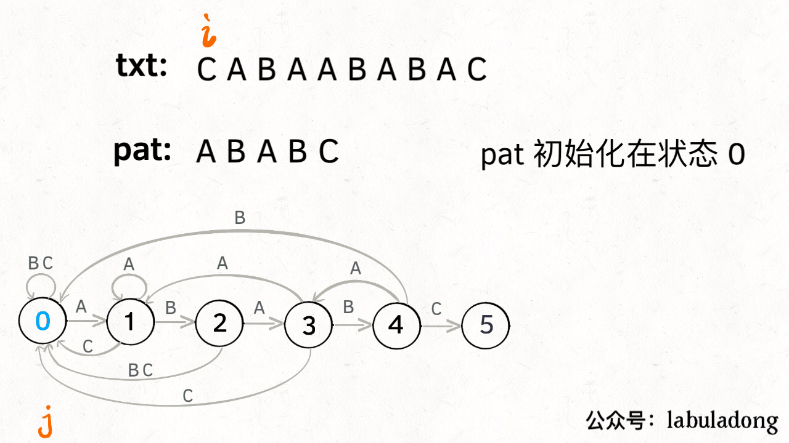
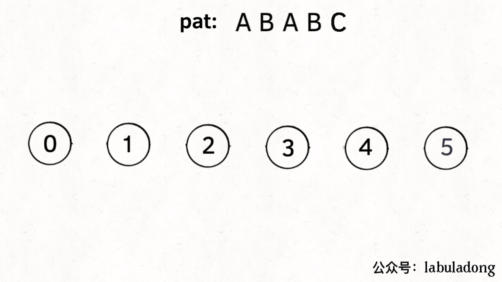

[TOC]

## LeetCode解法大全

**刷题刷题，刷的是题，培养的是思维，本篇的目的就是传递这种算法思维。**

**数据结构的存储方式只有两种：数组（顺序存储）和链表（链式存储）**。

各种数据结构的遍历 + 访问无非两种形式：线性的和非线性的。

线性就是 for/while 迭代为代表，非线性就是递归为代表。

数组是纯线性的，链表兼容线性和非线性，二叉树是典型的非线性递归遍历的。

写在前面，如果想提高有效的运行速度，那么

1. 寻找特定的边界，避免大量无效计算；
2. 对于回溯法来说全局定义数据；
3. 对于动归来说定义准确的回忆录dp[]，尽可能的降低为o1；
4. 用空间换时间，永远不过时。定义个visit[]比什么都重要。

参考资料

[手把手撕LeetCode题目，扒各种算法套路的裤子](https://github.com/labuladong/fucking-algorithm)

[leetcode解题之路](https://github.com/azl397985856/leetcode)

## 一、按解题思路

### 1、基础算法

- #### 哈希表

  HashMap用来计数；HashSet用来去重

  [1.两数之和](https://leetcode-cn.com/problems/two-sum/) [(解答)](1.两数之和.java) 求差后放map，也可用双指针（排好序了）。

  [13. 罗马数字转整数](https://leetcode-cn.com/problems/roman-to-integer/) [(解答)](13.罗马数字转整数.java) 用map绑定数据

  [137. 只出现一次的数字 II](https://leetcode-cn.com/problems/single-number-ii/) [(解答)](137.只出现一次的数字 II.java) 用set

  [205. 同构字符串](https://leetcode-cn.com/problems/isomorphic-strings/) [(解答)](205.同构字符串.java) 用hash 

  [219. 存在重复元素 II](https://leetcode-cn.com/problems/contains-duplicate-ii/) [(解答)](219.存在重复元素 II.java) 用set

  [290. 单词规律](https://leetcode-cn.com/problems/word-pattern/) [(解答)](290.单词规律.java) 用hash 

  [326. 3的幂](https://leetcode-cn.com/problems/power-of-three/) [(解答)](326.3的幂.java) 

  [349. 两个数组的交集](https://leetcode-cn.com/problems/intersection-of-two-arrays/) [(解答)](349.两个数组的交集.java) 用set

  [350. 两个数组的交集 II](https://leetcode-cn.com/problems/intersection-of-two-arrays-ii/) [(解答)](350.两个数组的交集 II.java) 用set

  [383. 赎金信](https://leetcode-cn.com/problems/ransom-note/) [(解答)](383.赎金信.java)  用数组替换map加速

  [387. 字符串中的第一个唯一字符](https://leetcode-cn.com/problems/first-unique-character-in-a-string/) [(解答)](387.字符串中的第一个唯一字符.java)  用数组替换map加速

- #### 翻转数字

  十进制数字的特性

  [7. 整数反转](https://leetcode-cn.com/problems/reverse-integer/) [(解答)](7.整数反转.java)

  [9. 回文数](https://leetcode-cn.com/problems/palindrome-number/) [(解答)](9.回文数.java)

- #### 排序后操作

  排序降低问题复杂度。

  [15. 三数之和](https://leetcode-cn.com/problems/3sum/) [(解答)](15.三数之和.java)

  [16. 最接近的三数之和](https://leetcode-cn.com/problems/3sum-closest/) [(解答)](16.最接近的三数之和.java) 配合双指针

  [56. 合并区间](https://leetcode-cn.com/problems/merge-intervals/) [(解答)](56.合并区间.java)

  [179. 最大数](https://leetcode-cn.com/problems/largest-number/) [(解答)](179.最大数.java) 对string组合后排序

  [217. 存在重复元素](https://leetcode-cn.com/problems/contains-duplicate/) [(解答)](217.存在重复元素.java)

  [274. H 指数](https://leetcode-cn.com/problems/h-index/) [(解答)](274.H 指数.java)

  [414. 第三大的数](https://leetcode-cn.com/problems/third-maximum-number/) [(解答)](414.第三大的数.java)

- #### 投票算法

  二元操作。

  [169. 多数元素](https://leetcode-cn.com/problems/majority-element/)  [(解答)](169.多数元素.java)

  [229. 求众数 II](https://leetcode-cn.com/problems/majority-element-ii/)  [(解答)](229.求众数 II.java) 不要求o1空间的话，用map最快最直接

  [242. 有效的字母异位词](https://leetcode-cn.com/problems/valid-anagram/) [(解答)](242.有效的字母异位词.java)

- #### 桶算法

  [299. 猜数字游戏](https://leetcode-cn.com/problems/bulls-and-cows/) [(解答)](299.猜数字游戏.java)

- #### 其他

  [43. 字符串相乘](https://leetcode-cn.com/problems/multiply-strings/) [(解答)](43.字符串相乘.java)

  [54. 螺旋矩阵](https://leetcode-cn.com/problems/spiral-matrix/) [(解答)](54.螺旋矩阵.java)

  [59. 螺旋矩阵 II](https://leetcode-cn.com/problems/spiral-matrix-ii/) [(解答)](59.螺旋矩阵 II.java)

  [65. 有效数字](https://leetcode-cn.com/problems/valid-number/) [(解答)](65.有效数字.java)

  [67. 二进制求和](https://leetcode-cn.com/problems/add-binary/) [(解答)](67.二进制求和.java)

  [118. 杨辉三角](https://leetcode-cn.com/problems/pascals-triangle/)  [(解答)](118.杨辉三角.java)

  [119. 杨辉三角 II](https://leetcode-cn.com/problems/pascals-triangle-ii/) [(解答)](119.杨辉三角 II.java)

  [172. 阶乘后的零](https://leetcode-cn.com/problems/factorial-trailing-zeroes/) [(解答)](172.阶乘后的零.java)

  [263. 丑数](https://leetcode-cn.com/problems/ugly-number/) [(解答)](263.丑数.java)

  [268. 缺失数字](https://leetcode-cn.com/problems/missing-number/) [(解答)](268.缺失数字.java) 高斯算法

  [390. 消除游戏](https://leetcode-cn.com/problems/elimination-game/) [(解答)](390.消除游戏.java)

  [398. 随机数索引](https://leetcode-cn.com/problems/random-pick-index/)[(解答)](398.随机数索引.java) 蓄水池算法

  [400. 第N个数字](https://leetcode-cn.com/problems/nth-digit/) [(解答)](400.第N个数字.java) 

  [412. Fizz Buzz](https://leetcode-cn.com/problems/fizz-buzz/) [(解答)](412.Fizz Buzz.java) 

- #### tricker

  [231. 2的幂](https://leetcode-cn.com/problems/power-of-two/) [(解答)](231.2的幂.java)

  [258. 各位相加](https://leetcode-cn.com/problems/add-digits/) [(解答)](258.各位相加.java)

  [292. Nim 游戏](https://leetcode-cn.com/problems/nim-game/) [(解答)](292.Nim 游戏.java)

  [342. 4的幂](https://leetcode-cn.com/problems/power-of-four/) [(解答)](342.4的幂.java)

  [459. 重复的子字符串](https://leetcode-cn.com/problems/repeated-substring-pattern/) [(解答)](459.重复的子字符串.java)

  [575. 分糖果](https://leetcode-cn.com/problems/distribute-candies/) [(解答)](575.分糖果.java)

  [877. 石子游戏](https://leetcode-cn.com/problems/stone-game/) [(解答)](877.石子游戏.java)

  [1025. 除数博弈](https://leetcode-cn.com/problems/divisor-game/) [(解答)](1025.除数博弈.java)
  
  [1332. 删除回文子序列](https://leetcode-cn.com/problems/remove-palindromic-subsequences/) [(解答)](1332.删除回文子序列.java)
  
  [面试题 17.04. 消失的数字](https://leetcode-cn.com/problems/missing-number-lcci/) [(解答)](面试题17.04. 消失的数字.java)

### 2、位运算

利用异或操作 `^` 和空格进行英文字符大小写互换`('d' ^ ' ') = 'D'` `('D' ^ ' ') = 'd'`

消除数字 n 的二进制表示中的最后一个 1。`n&(n-1)`

异或 ^ 可以消除相同的数字。`0^n=n` `n^n=0`

面对反复执行的乘除操作，可以考虑 << 1 翻倍。

交换两个数

```java
int a = 1, b = 2;
a ^= b;
b ^= a;
a ^= b;
// 现在 a = 2, b = 1
```

[29. 两数相除](https://leetcode-cn.com/problems/divide-two-integers/) [(解答)](29.两数相除.java)

[50. Pow(x, n)](https://leetcode-cn.com/problems/powx-n/) [(解答)](50.Pow(x, n).java)

[136. 只出现一次的数字](https://leetcode-cn.com/problems/single-number/) [(解答)](136.只出现一次的数字.java)

[190. 颠倒二进制位](https://leetcode-cn.com/problems/reverse-bits/) [(解答)](190.颠倒二进制位.java)

[191. 位1的个数](https://leetcode-cn.com/problems/number-of-1-bits/) [(解答)](191.位1的个数.java)

[201. 数字范围按位与](https://leetcode-cn.com/problems/bitwise-and-of-numbers-range/) [(解答)](201.数字范围按位与.java)

[260. 只出现一次的数字 III](https://leetcode-cn.com/problems/single-number-iii/)  [(解答)](260.只出现一次的数字 III.java) 自己与-自己可以找到 不同的1的那个bit位。

[371. 两整数之和](https://leetcode-cn.com/problems/sum-of-two-integers/) [(解答)](371.两整数之和.java) 不用+ -，计算求和

[389. 找不同](https://leetcode-cn.com/problems/find-the-difference/) [(解答)](389.找不同.java)

[397. 整数替换](https://leetcode-cn.com/problems/integer-replacement/) [(解答)](397.整数替换.java)

[401. 二进制手表](https://leetcode-cn.com/problems/binary-watch/) [(解答)](401.二进制手表.java)

[405. 数字转换为十六进制数](https://leetcode-cn.com/problems/convert-a-number-to-hexadecimal/) [(解答)](405.数字转换为十六进制数.java)

[461. 汉明距离](https://leetcode-cn.com/problems/hamming-distance/) [(解答)](461.汉明距离.java)

[476. 补数](https://leetcode-cn.com/problems/number-complement/) [(解答)](476.补数.java)

[面试题 16.01. 交换数字](https://leetcode-cn.com/problems/swap-numbers-lcci/) [(解答)](面试题16.01.交换数字.java)

### 3、双指针

快慢指针：找链表的环，找链表中点，寻找链表倒数第K元素。

左右指针：二分查找，翻转数组，滑动窗口。

[5. 最长回文子串](https://leetcode-cn.com/problems/longest-palindromic-substring/) [(解答)](5.最长回文.java)

[19. 删除链表的倒数第N个节点](https://leetcode-cn.com/problems/remove-nth-node-from-end-of-list/) [(解答)](19.删除链表的倒数第N个节点.java)

[42. 接雨水](https://leetcode-cn.com/problems/trapping-rain-water/) [(解答)](42.接雨水.java)

[75. 颜色分类](https://leetcode-cn.com/problems/sort-colors/)  [(解答)](75.颜色分类.java)

[125. 验证回文串](https://leetcode-cn.com/problems/valid-palindrome/) [(解答)](125.验证回文串.java)

[141. 环形链表](https://leetcode-cn.com/problems/linked-list-cycle/) [(解答)](141.环形链表.java)

[142. 环形链表 II](https://leetcode-cn.com/problems/linked-list-cycle-ii/) [(解答)](142.环形链表2.java)

[202. 快乐数](https://leetcode-cn.com/problems/happy-number/) [(解答)](202.快乐数.java)

[287. 寻找重复数](https://leetcode-cn.com/problems/find-the-duplicate-number/) [(解答)](287.寻找重复数.java)

### 4、二分查找

看到时间要求有log的 要考虑二分。有序（部分有序）数组要考虑二分。

对于寻找左右边界的二分搜索，常见的手法是使用左闭右开的「搜索区间」，**我们还根据逻辑将「搜索区间」全都统一成了两端都闭，便于记忆，只要修改两处即可变化出三种写法**：

```java
int binary_search(int[] nums, int target) {
    int left = 0, right = nums.length - 1; 
    while(left <= right) {
        int mid = left + (right - left) / 2;
        if (nums[mid] < target) {
            left = mid + 1;
        } else if (nums[mid] > target) {
            right = mid - 1; 
        } else if(nums[mid] == target) {
            // 直接返回
            return mid;
        }
    }
    // 直接返回
    return -1;
}

int left_bound(int[] nums, int target) {
    int left = 0, right = nums.length - 1;
    while (left <= right) {
        int mid = left + (right - left) / 2;
        if (nums[mid] < target) {
            left = mid + 1;
        } else if (nums[mid] > target) {
            right = mid - 1;
        } else if (nums[mid] == target) {
            // 别返回，锁定左侧边界
            right = mid - 1;
        }
    }
    // 最后要检查 left 越界的情况
    if (left >= nums.length || nums[left] != target)
        return -1;
    return left;
}


int right_bound(int[] nums, int target) {
    int left = 0, right = nums.length - 1;
    while (left <= right) {
        int mid = left + (right - left) / 2;
        if (nums[mid] < target) {
            left = mid + 1;
        } else if (nums[mid] > target) {
            right = mid - 1;
        } else if (nums[mid] == target) {
            // 别返回，锁定右侧边界
            left = mid + 1;
        }
    }
    // 最后要检查 right 越界的情况
    if (right < 0 || nums[right] != target)
        return -1;
    return right;
}
```

1、分析二分查找代码时，不要出现 else，全部展开成 else if 方便理解。

2、注意「搜索区间」和 while 的终止条件，如果存在漏掉的元素，记得在最后检查。

3、如需定义左闭右开的「搜索区间」搜索左右边界，只要在 `nums[mid] == target` 时做修改即可，搜索右侧时需要减一。

4、如果将「搜索区间」全都统一成两端都闭，好记，只要稍改 `nums[mid] == target` 条件处的代码和返回的逻辑即可。

[4. 寻找两个正序数组的中位数](https://leetcode-cn.com/problems/median-of-two-sorted-arrays/) [(解答)](4.寻找正序数组中位数.java)

[33. 搜索旋转排序数组](https://leetcode-cn.com/problems/search-in-rotated-sorted-array/) [(解答)](33.搜索旋转排序数组.java)

[34. 在排序数组中查找元素的第一个和最后一个位置](https://leetcode-cn.com/problems/find-first-and-last-position-of-element-in-sorted-array/) [(解答)](34.在排序数组中查找元素的第一个和最后一个位置.java)

[35. 搜索插入位置](https://leetcode-cn.com/problems/search-insert-position/) [(解答)](35.搜索插入位置.java)

[69. x 的平方根](https://leetcode-cn.com/problems/sqrtx/) [(解答)](69.x 的平方根.java)

[74. 搜索二维矩阵](https://leetcode-cn.com/problems/search-a-2d-matrix/) [(解答)](74.搜索二维矩阵.java)

[148. 排序链表](https://leetcode-cn.com/problems/sort-list/)  [(解答)](148.链表排序.java) 双指针找mid

[162. 寻找峰值](https://leetcode-cn.com/problems/find-peak-element/) [(解答)](162.寻找峰值.java)

[153. 寻找旋转排序数组中的最小值](https://leetcode-cn.com/problems/find-minimum-in-rotated-sorted-array/) [(解答)](153.寻找旋转排序数组中的最小值.java)

[154. 寻找旋转排序数组中的最小值 II](https://leetcode-cn.com/problems/find-minimum-in-rotated-sorted-array-ii/) [(解答)](153.寻找旋转排序数组中的最小值.java)

[278. 第一个错误的版本](https://leetcode-cn.com/problems/first-bad-version/) [(解答)](278.第一个错误的版本.java)

[367. 有效的完全平方数](https://leetcode-cn.com/problems/valid-perfect-square/) [(解答)](367.有效的完全平方数.java)

[374. 猜数字大小](https://leetcode-cn.com/problems/guess-number-higher-or-lower/)  [(解答)](374.猜数字大小.java)

[441. 排列硬币](https://leetcode-cn.com/problems/arranging-coins/) [(解答)](441.排列硬币.java)

### 5、滑动窗口

```java
// 滑动窗口算法的抽象思想
int left = 0, right = 0;

while (right < s.size()) {
    window.add(s[right]);
    right++;
    
    while (valid) {
        window.remove(s[left]);
        left++;
    }
}
```

[3.无重复字符的最长子串](https://leetcode-cn.com/problems/longest-substring-without-repeating-characters) [(解答)](3.无重复字符最长子串.java)

[49. 字母异位词分组](https://leetcode-cn.com/problems/group-anagrams/) [(解答)](49.字母异位词分组.java)

[76. 最小覆盖子串](https://leetcode-cn.com/problems/minimum-window-substring/) [(解答)](76.最小覆盖子串.java)

### 6、动归

**求解动态规划的核心问题是穷举**。而且，动态规划问题一定会**具备「最优子结构」**，才能通过子问题的最值得到原问题的最值。

明确「状态」 -> 定义 dp 数组/函数的含义 -> 明确「选择」-> 明确 base case。最终目的是找出状态转移方程。

一般的步骤是1.暴利解；2.发现重叠子问题；3.加备忘录解；4.状态转移方程，优化空间效率。

关于动归的遍历顺序问题，需要重点把握两个要点。

**1、遍历的过程中，所需的状态必须是已经计算出来的**。

**2、遍历的终点必须是存储结果的那个位置**。

[11. 盛最多水的容器](https://leetcode-cn.com/problems/container-with-most-water/) [(解答)](11.盛最多水的容器.java)

[45. 跳跃游戏 II](https://leetcode-cn.com/problems/jump-game-ii/) [(解答)](45.跳跃游戏2.java)

[53. 最大子序和](https://leetcode-cn.com/problems/maximum-subarray/) [(解答)](53.最大子序和.java)

[55. 跳跃游戏](https://leetcode-cn.com/problems/jump-game/) [(解答)](55.跳跃游戏.java)

[64. 最小路径和](https://leetcode-cn.com/problems/minimum-path-sum/) [(解答)](64.最小路径和.java)

[91. 解码方法](https://leetcode-cn.com/problems/decode-ways/) [(解答)](91.解码方法.java)

[96. 不同的二叉搜索树](https://leetcode-cn.com/problems/unique-binary-search-trees/) [(解答)](96.不同的二叉搜索树.java) 略难。

[135. 分发糖果](https://leetcode-cn.com/problems/candy/) [(解答)](135.分发糖果.java) 

[152. 乘积最大子数组](https://leetcode-cn.com/problems/maximum-product-subarray/) [(解答)](152.乘积最大子数组.java) 

[300. 最长上升子序列](https://leetcode-cn.com/problems/longest-increasing-subsequence/) [(解答)](300.最长上升子序列.java) 

[357. 计算各个位数不同的数字个数](https://leetcode-cn.com/problems/count-numbers-with-unique-digits/) [(解答)](357.计算各个位数不同的数字个数.java) 

[409. 最长回文串](https://leetcode-cn.com/problems/longest-palindrome/) [(解答)](409.最长回文串.java) 贪心

[413. 等差数列划分](https://leetcode-cn.com/problems/arithmetic-slices/) [(解答)](413.等差数列划分.java) 

[455. 分发饼干](https://leetcode-cn.com/problems/assign-cookies/) [(解答)](455.分发饼干.java) 

[509. 斐波那契数](https://leetcode-cn.com/problems/fibonacci-number/) [(解答)](509.斐波那契数.java) 

[剑指 Offer 60. n个骰子的点数](https://leetcode-cn.com/problems/nge-tou-zi-de-dian-shu-lcof/) [(解答)](剑指 Offer 60. n个骰子的点数.java) 

- #### 股票问题

```
dp[i][k][0] = max(dp[i-1][k][0], dp[i-1][k][1] + prices[i])
              max(   选择 rest  ,             选择 sell      )

解释：今天我没有持有股票，有两种可能：
要么是我昨天就没有持有，然后今天选择 rest，所以我今天还是没有持有；
要么是我昨天持有股票，但是今天我 sell 了，所以我今天没有持有股票了。

dp[i][k][1] = max(dp[i-1][k][1], dp[i-1][k-1][0] - prices[i])
              max(   选择 rest  ,           选择 buy         )

解释：今天我持有着股票，有两种可能：
要么我昨天就持有着股票，然后今天选择 rest，所以我今天还持有着股票；
要么我昨天本没有持有，但今天我选择 buy，所以今天我就持有股票了。
```

[121. 买卖股票的最佳时机](https://leetcode-cn.com/problems/best-time-to-buy-and-sell-stock/) [(解答)](121.买卖股票的最佳时机.java)

[122. 买卖股票的最佳时机 II](https://leetcode-cn.com/problems/best-time-to-buy-and-sell-stock-ii/) [(解答)](122.买卖股票的最佳时机 II.java) 贪心

- #### 打家劫舍

[198. 打家劫舍](https://leetcode-cn.com/problems/house-robber/) [(解答)](198.打家劫舍.java)

[213. 打家劫舍 II](https://leetcode-cn.com/problems/house-robber-ii/) [(解答)](213.打家劫舍 II.java) 带圈的

[337. 打家劫舍 III](https://leetcode-cn.com/problems/house-robber-iii/) [(解答)](337.打家劫舍 III.java)  树形

### 7、备忘录

常用作动归降低时间复杂度使用。

[139. 单词拆分](https://leetcode-cn.com/problems/word-break/) [(解答)](139.单词拆分.java) 

[204. 计数质数](https://leetcode-cn.com/problems/count-primes/) [(解答)](204.计数质数.java)

[264. 丑数 II](https://leetcode-cn.com/problems/ugly-number-ii/) [(解答)](264.丑数 II.java) 注意静态常量初始化

[剑指 Offer 50. 第一个只出现一次的字符](https://leetcode-cn.com/problems/di-yi-ge-zhi-chu-xian-yi-ci-de-zi-fu-lcof/) [(解答)](剑指 Offer 50. 第一个只出现一次的字符.java)

### 8、回溯

 回溯算法就是个多叉树的遍历问题，关键就是在前序遍历和后序遍历的位置做一些操作，一般见到`List<List<Object>>`这种返回结构要考虑回溯算法。算法框架如下：

```java
List<List<Object>> result=new ArrayList<>();
List<Object> tmp=new ArrayList<>();

List<List<Object>> func(List<Object> input){
  
}

void doFunc(List<Object> input, int start, int target){
  if (满足结束条件){
    result.add(new ArrayList(tmp));// 因为tmp要一直使用，只有一个对象
  	return;
  }
  for (int i = start;i < input.size();i++){
    // 如果有增强条件在这里做操作
    if (target-object < 0){
      break;
    }
    if (full || i > start && input.get(i) == input.get(i - 1)){
      continue;
    }
    tmp.add(object);
    doFunc(input, start+1, target-object);
    tmp.remove(last);
  }
}
```
记住这几种树的形状，就足以应对大部分回溯算法问题了，无非就是 `start` 或者 `contains` 剪枝，也没啥别的技巧了。

[17. 电话号码的字母组合](https://leetcode-cn.com/problems/letter-combinations-of-a-phone-number/) [(解答)](17.电话号码组合.java)

[18. 四数之和](https://leetcode-cn.com/problems/4sum/) [(解答)](18.四数之和.java)

[39. 组合总和](https://leetcode-cn.com/problems/combination-sum/) [(解答)](39.组合总和.java)

[40. 组合总和 II](https://leetcode-cn.com/problems/combination-sum-ii/) [(解答)](40.组合总和 II.java)

[46. 全排列](https://leetcode-cn.com/problems/permutations/) [(解答)](46.全排列.java)

[47. 全排列 II](https://leetcode-cn.com/problems/permutations-ii/) [(解答)](47.全排列2.java)

[62. 不同路径](https://leetcode-cn.com/problems/unique-paths/) [(解答)](62.不同路径.java)

[77. 组合](https://leetcode-cn.com/problems/combinations/)  [(解答)](77.组合.java)

[78. 子集](https://leetcode-cn.com/problems/subsets/)  [(解答)](78.子集.java)

[90. 子集 II](https://leetcode-cn.com/problems/subsets-ii/) [(解答)](90.子集 II.java)

[93. 复原IP地址](https://leetcode-cn.com/problems/restore-ip-addresses/)  [(解答)](93.复原IP地址.java) 比较特殊的回溯写法。

[113. 路径总和 II](https://leetcode-cn.com/problems/path-sum-ii/)  [(解答)](113.路径总和 II.java) 借用树的形式

[131. 分割回文串](https://leetcode-cn.com/problems/palindrome-partitioning/) [(解答)](131.分割回文串.java)

[491. 递增子序列](https://leetcode-cn.com/problems/increasing-subsequences/) [(解答)](491.递增子序列.java)

### 9、递归

**明白一个函数的作用并相信它能完成这个任务，千万不要试图跳进细节**

[38. 外观数列](https://leetcode-cn.com/problems/count-and-say/) [(解答)](38.外观数列.java)

[60. 第k个排列](https://leetcode-cn.com/problems/permutation-sequence/) [(解答)](60.第k个排列.java)

[70. 爬楼梯](https://leetcode-cn.com/problems/climbing-stairs/) [(解答)](70.爬楼梯.java)

[189. 旋转数组](https://leetcode-cn.com/problems/rotate-array/) [(解答)](189.翻转数组.java)

## 二、按题目分类

### 1、链表

常用dummy头结点，保证链表为空正确返回。

与双指针配合使用，先上1个cur指针，再用fast slow思想，最后用pre cur next思想。一般来说不会用到4指针。

用纸笔画一下，更好的得出结论。

[2.两数相加](https://leetcode-cn.com/problems/add-two-numbers) [(解答)](2.两数相加.java)

[19. 删除链表的倒数第N个节点](https://leetcode-cn.com/problems/remove-nth-node-from-end-of-list/) [(解答)](19.删除链表的倒数第N个节点.java)

[21. 合并两个有序链表](https://leetcode-cn.com/problems/merge-two-sorted-lists/) [(解答)](21.合并两个有序链表.java)

[24. 两两交换链表中的节点](https://leetcode-cn.com/problems/swap-nodes-in-pairs/) [(解答)](24.两两交换链表中的节点.java)

[25. K 个一组翻转链表](https://leetcode-cn.com/problems/reverse-nodes-in-k-group/) [(解答)](25.K 个一组翻转链表.java)

[61. 旋转链表](https://leetcode-cn.com/problems/rotate-list/) [(解答)](61.旋转链表.java)

[82. 删除排序链表中的重复元素 II](https://leetcode-cn.com/problems/remove-duplicates-from-sorted-list-ii/)  [(解答)](82.删除排序链表中的重复元素 II.java)

[83. 删除排序链表中的重复元素](https://leetcode-cn.com/problems/remove-duplicates-from-sorted-list/) [(解答)](83.删除排序链表中的重复元素.java)

[86. 分隔链表](https://leetcode-cn.com/problems/partition-list/) [(解答)](86.分隔链表.java)

[92. 反转链表 II](https://leetcode-cn.com/problems/reverse-linked-list-ii/)  [(解答)](92.翻转链表2.java)

[143. 重排链表](https://leetcode-cn.com/problems/reorder-list/) [(解答)](143.重排链表.java) 找中点、翻转链表组合

[160. 相交链表](https://leetcode-cn.com/problems/intersection-of-two-linked-lists/) [(解答)](160.相交链表.java)

[203. 移除链表元素](https://leetcode-cn.com/problems/remove-linked-list-elements/)[(解答)](203.移除链表元素.java)

[206. 反转链表](https://leetcode-cn.com/problems/reverse-linked-list/)  [(解答)](206.反转链表.java)

[234. 回文链表](https://leetcode-cn.com/problems/palindrome-linked-list/)  [(解答)](234.回文链表.java) 可以转数组走回文数组双指针；也可找链表中点翻转，同位置比较。

[328. 奇偶链表](https://leetcode-cn.com/problems/odd-even-linked-list/) [(解答)](328.奇偶链表.java)

[876. 链表的中间结点](https://leetcode-cn.com/problems/middle-of-the-linked-list/) [(解答)](876.链表的中间结点.java)

### 2、字符串

[3.无重复字符的最长子串](https://leetcode-cn.com/problems/longest-substring-without-repeating-characters) [(解答)](3.无重复字符最长子串.java)

[14. 最长公共前缀](https://leetcode-cn.com/problems/longest-common-prefix/) [(解答)](14.最长公共前缀.java)

[28. 实现 strStr()](https://leetcode-cn.com/problems/implement-strstr/) [(解答)](28.自定义indexOf.java)

[58. 最后一个单词的长度](https://leetcode-cn.com/problems/length-of-last-word/) [(解答)](58.最后一个单词的长度.java)

[344. 反转字符串](https://leetcode-cn.com/problems/reverse-string/) [(解答)](344.反转字符串.java)

[392. 判断子序列](https://leetcode-cn.com/problems/is-subsequence/) [(解答)](392.判断子序列.java)

[415. 字符串相加](https://leetcode-cn.com/problems/add-strings/) [(解答)](415.字符串相加.java)

### 3、栈队列

[20. 有效的括号](https://leetcode-cn.com/problems/valid-parentheses/) [(解答)](20.有效括号.java)

[150. 逆波兰表达式求值](https://leetcode-cn.com/problems/evaluate-reverse-polish-notation/) [(解答)](150.逆波兰表达式求值.java)

[155. 最小栈](https://leetcode-cn.com/problems/min-stack/) [(解答)](155.最小栈.java)

[225. 用队列实现栈](https://leetcode-cn.com/problems/implement-stack-using-queues/) [(解答)](225.用队列实现栈.java)

[232. 用栈实现队列](https://leetcode-cn.com/problems/implement-queue-using-stacks/) [(解答)](232.用栈实现队列.java)

[402. 移掉K位数字](https://leetcode-cn.com/problems/remove-k-digits/) [(解答)](402.移掉K位数字.java)

[445. 两数相加 II](https://leetcode-cn.com/problems/add-two-numbers-ii/) [(解答)](445.两数相加 II.java)

[496. 下一个更大元素 I](https://leetcode-cn.com/problems/next-greater-element-i/) [(解答)](496.下一个更大元素 I.java)

### 4、数组

掌握二分排序，桶排序即可。快排、冒泡、计数排序了解。

[26. 删除排序数组中的重复项](https://leetcode-cn.com/problems/remove-duplicates-from-sorted-array/)  [(解答)](26.删除排序数组中的重复项.java)

[27. 移除元素](https://leetcode-cn.com/problems/remove-element/) [(解答)](27.移除元素.java)

[31. 下一个排列](https://leetcode-cn.com/problems/next-permutation/) [(解答)](31.下一个排列.java)

[48. 旋转图像](https://leetcode-cn.com/problems/rotate-image/) [(解答)](48.旋转图像.java)

[80. 删除排序数组中的重复项 II](https://leetcode-cn.com/problems/remove-duplicates-from-sorted-array-ii/)  [(解答)](80.删除排序数组中的重复项 II.java)

[88. 合并两个有序数组](https://leetcode-cn.com/problems/merge-sorted-array/)  [(解答)](88.合并两个有序数组.java)

[215. 数组中的第K个最大元素](https://leetcode-cn.com/problems/kth-largest-element-in-an-array/)  [(解答)](215.数组第k大.java) 考验排序的

[240. 搜索二维矩阵 II](https://leetcode-cn.com/problems/search-a-2d-matrix-ii/) [(解答)](240.搜索二维矩阵 II.java)

[283. 移动零](https://leetcode-cn.com/problems/move-zeroes/) [(解答)](283.移动零.java)

[295. 数据流的中位数](https://leetcode-cn.com/problems/find-median-from-data-stream/) [(解答)](295.数据流的中位数.java) 两个优先集合

[347. 前 K 个高频元素](https://leetcode-cn.com/problems/top-k-frequent-elements/) [(解答)](347.前 K 个高频元素.java) 考验排序

[485. 最大连续1的个数](https://leetcode-cn.com/problems/max-consecutive-ones/) [(解答)](485.最大连续1的个数.java)

[1260. 二维网格迁移](https://leetcode-cn.com/problems/shift-2d-grid/) [(解答)](1260.二维网格迁移.java)

### 5、树

1. 二叉树算法设计的总路线：把当前节点要做的事做好，其他的交给递归框架，不用当前节点操心。
2. 如果当前节点会对下面的子节点有整体影响，可以通过辅助函数增长参数列表，借助参数传递信息。
3. 在二叉树框架之上，扩展出一套 BST 遍历框架：

```java
void BST(TreeNode root, int target) {
    if (root.val == target)
        // 找到目标，做点什么
    if (root.val < target) 
        BST(root.right, target);
    if (root.val > target)
        BST(root.left, target);
}
```

[94. 二叉树的中序遍历](https://leetcode-cn.com/problems/binary-tree-inorder-traversal/)  [(解答)](144.二叉树遍历.java) 中序遍历 

[98. 验证二叉搜索树](https://leetcode-cn.com/problems/validate-binary-search-tree/)  [(解答)](98.验证二叉搜索树.java) 中序遍历 

[99. 恢复二叉搜索树](https://leetcode-cn.com/problems/recover-binary-search-tree/) [(解答)](99.恢复二叉搜索树.java) 中序遍历 

[100. 相同的树](https://leetcode-cn.com/problems/same-tree/)  [(解答)](100.相同的树.java) 递归遍历

[101. 对称二叉树](https://leetcode-cn.com/problems/symmetric-tree/)  [(解答)](101.对称二叉树.java) 递归遍历

[102. 二叉树的层序遍历](https://leetcode-cn.com/problems/binary-tree-level-order-traversal/) [(解答)](103.二叉树的锯齿形层次遍历.java) 层次遍历

[103. 二叉树的锯齿形层次遍历](https://leetcode-cn.com/problems/binary-tree-zigzag-level-order-traversal/)  [(解答)](103.二叉树的锯齿形层次遍历.java) 层次遍历

[104. 二叉树的最大深度](https://leetcode-cn.com/problems/maximum-depth-of-binary-tree/)  [(解答)](104.二叉树的最大深度.java) 层次遍历

[105. 从前序与中序遍历序列构造二叉树](https://leetcode-cn.com/problems/construct-binary-tree-from-preorder-and-inorder-traversal/) [(解答)](105.从前序与中序遍历序列构造二叉树.java) 递归建树

[107. 二叉树的层次遍历 II](https://leetcode-cn.com/problems/binary-tree-level-order-traversal-ii/) [(解答)](107.二叉树的层次遍历 II.java) 层次遍历

[108. 将有序数组转换为二叉搜索树](https://leetcode-cn.com/problems/convert-sorted-array-to-binary-search-tree/) [(解答)](108.将有序数组转换为二叉搜索树.java) 二分法建树

[109. 有序链表转换二叉搜索树](https://leetcode-cn.com/problems/convert-sorted-list-to-binary-search-tree/)  [(解答)](109.有序链表转换二叉搜索树.java) 二分法建树

[110. 平衡二叉树](https://leetcode-cn.com/problems/balanced-binary-tree/) [(解答)](110.平衡二叉树.java) 双重递归，判定高度

[111. 二叉树的最小深度](https://leetcode-cn.com/problems/minimum-depth-of-binary-tree/) [(解答)](111.二叉树的最小深度.java) 递归遍历

[112. 路径总和](https://leetcode-cn.com/problems/path-sum/) [(解答)](112.路径总和.java) 递归遍历

[114. 二叉树展开为链表](https://leetcode-cn.com/problems/flatten-binary-tree-to-linked-list/) [(解答)](114.二叉树展开为链表.java) 找到最右节点

[129. 求根到叶子节点数字之和](https://leetcode-cn.com/problems/sum-root-to-leaf-numbers/) [(解答)](129.求根到叶子节点数字之和.java) 基本遍历+十进制特性

[144. 二叉树的前序遍历](https://leetcode-cn.com/problems/binary-tree-preorder-traversal/) [(解答)](144.二叉树遍历.java) 前序遍历

[145. 二叉树的后序遍历](https://leetcode-cn.com/problems/binary-tree-postorder-traversal/) [(解答)](144.二叉树遍历.java) 前序遍历（部分改动+集合翻转）

[199. 二叉树的右视图](https://leetcode-cn.com/problems/binary-tree-right-side-view/) [(解答)](199.二叉树的右视图.java) 层次遍历

[222. 完全二叉树的节点个数](https://leetcode-cn.com/problems/count-complete-tree-nodes/) [(解答)](222.完全二叉树的节点个数.java)

[226. 翻转二叉树](https://leetcode-cn.com/problems/invert-binary-tree/) [(解答)](226.翻转二叉树.java) 递归遍历

[230. 二叉搜索树中第K小的元素](https://leetcode-cn.com/problems/kth-smallest-element-in-a-bst/) [(解答)](230.二叉搜索树中第K小的元素.java) 栈遍历

[235. 二叉搜索树的最近公共祖先](https://leetcode-cn.com/problems/lowest-common-ancestor-of-a-binary-search-tree/) [(解答)](235.二叉搜索树的最近公共祖先.java)

[236. 二叉树的最近公共祖先](https://leetcode-cn.com/problems/lowest-common-ancestor-of-a-binary-tree/) [(解答)](236.二叉树的最近公共祖先.java)

[257. 二叉树的所有路径](https://leetcode-cn.com/problems/binary-tree-paths/) [(解答)](257.二叉树的所有路径.java) 深度优先遍历

[297. 二叉树的序列化与反序列化](https://leetcode-cn.com/problems/serialize-and-deserialize-binary-tree/) [(解答)](297.二叉树的序列化与反序列化.java) 层次遍历建树

[429. N叉树的层序遍历](https://leetcode-cn.com/problems/n-ary-tree-level-order-traversal/) [(解答)](429.N叉树的层序遍历.java) 

[1022. 从根到叶的二进制数之和](https://leetcode-cn.com/problems/sum-of-root-to-leaf-binary-numbers/) [(解答)](1022.从根到叶的二进制数之和.java) 129的二进制表达

### 6、构造型

[380. 常数时间插入、删除和获取随机元素](https://leetcode-cn.com/problems/insert-delete-getrandom-o1/) [(解答)](380.常数时间插入、删除和获取随机元素.java) 

[382. 链表随机节点](https://leetcode-cn.com/problems/linked-list-random-node/) [(解答)](382.链表随机节点.java) 

## 三、特种算法

### 1、kmp算法



**请记住这个 GIF 的匹配过程，这就是 KMP 算法的核心逻辑**！

```java
public class KMP {
    private int[][] dp;
    private String pat;

    public KMP(String pat) {
        this.pat = pat;
        int M = pat.length();
        // dp[状态][字符] = 下个状态
        dp = new int[M][256];
        // base case
        dp[0][pat.charAt(0)] = 1;
        // 影子状态 X 初始为 0
        int X = 0;
        // 构建状态转移图（稍改的更紧凑了）
        for (int j = 1; j < M; j++) {
            for (int c = 0; c < 256; c++)
                dp[j][c] = dp[X][c];
            dp[j][pat.charAt(j)] = j + 1;
            // 更新影子状态
            X = dp[X][pat.charAt(j)];
        }
    }

    public int search(String txt) {
        int M = pat.length();
        int N = txt.length();
        // pat 的初始态为 0
        int j = 0;
        for (int i = 0; i < N; i++) {
            // 计算 pat 的下一个状态
            j = dp[j][txt.charAt(i)];
            // 到达终止态，返回结果
            if (j == M) return i - M + 1;
        }
        // 没到达终止态，匹配失败
        return -1;
    }
}
```

**其中的原理非常微妙**，注意代码中 for 循环的变量初始值，可以这样理解：后者是在 `txt` 中匹配 `pat`，前者是在 `pat` 中匹配 `pat[1..end]`，状态 `X` 总是落后状态 `j` 一个状态，与 `j` 具有最长的相同前缀。所以我把 `X` 比喻为影子状态，似乎也有一点贴切。

另外，构建 dp 数组是根据 base case `dp[0][..]` 向后推演。

